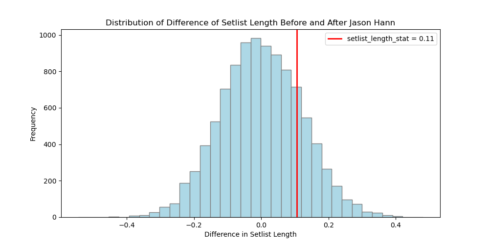
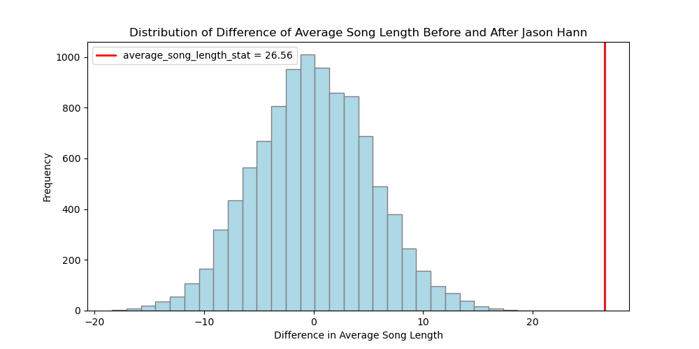
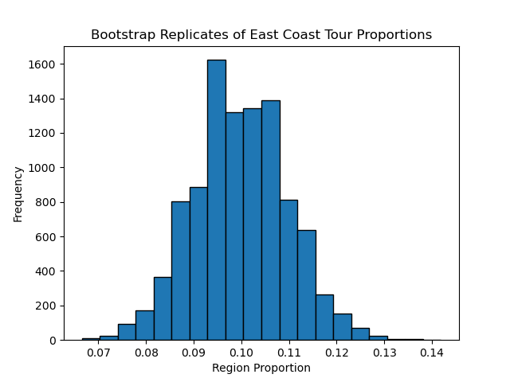
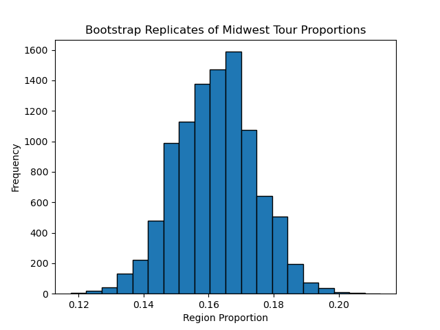
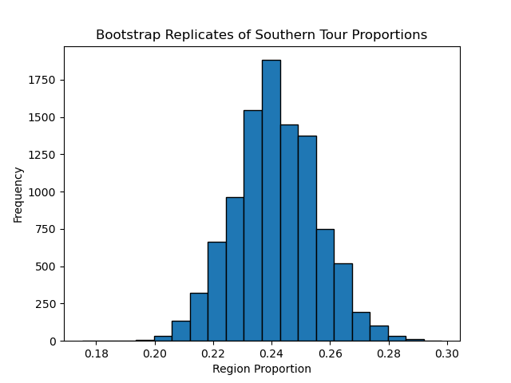
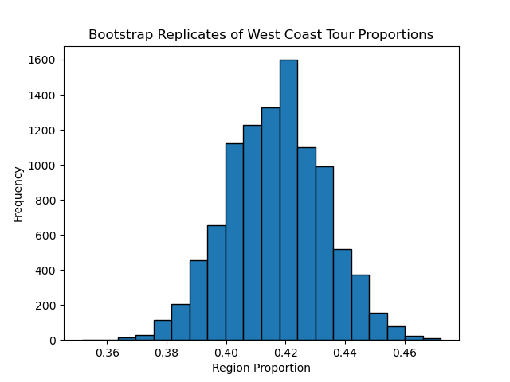

# SEIS 631 Final Project

## Description
Sourced information contains the following information about an artist (The String Cheese Incident):
- Date of event
- Venue of event
- City/State event
- Setlists:
  - Set number
  - Songs in setlist
    - Song length (minutes and seconds)
  - Encore yes/no

### Additional Context

The Colorado jam band formed in 1993 originally composed of the members:

- Bill Nershi (Guitar)
- Michael Kang (Acoustic/Electric Mandolin, Violin)
- Michael Travis (Percussion, Drums)
- Keith Moseley (Bass)

In 1996, they added the keyboardist Kyle Hollingsworth and gained a very successful following with their live performances that blended multiple genres such as bluegrass, country, rock, reggae, funk and more with
 unpredictable improvisation to push songs to their limits. Notably, the drummer (Michael Travis) would often times drum with one hand, and playing percussion with the other resulting in unique polyrhythms; occasionally they would feature
an additional percussionist to the stage. On October 31st, 2004 they officially added Jason Hann to the band as the percussionist, take allowed some of the load off of Michael Travis while also allowing the band to explore more genres, in particular
electronic/EDM sounds.

When Jason joined the band, this has often been a point of disagreement amongst the fans, some stating that the addition was unnecessary and strayed the band too far away from their bluegrass roots, while others supported the ever-changing soundscape that
they felt was a core feature of the band. Using this, the core question being asked with the data is: _"how did the addition of Jason Hann change the band"_. This question was used to formulate the two hypotheses in this project, while the confidence interval
bootstraps were used to explore variances in particular metrics.

## Source
A crawler code was generated using ChatGPT to scrape for live recording information from: https://play.nugs.net/browse/artist/2. This [output data](data/cheese_nugs.json) was formatted as an array JSON, which then could be converted as a dataframe in Python/Pandas. 

## Data Analysis

### Permutation Test: Hypothesis 1

#### Background

Using the foundational question "how did Jason Hann change the dynamic of the band", the first hypothesis I created was "The average number of songs played in a setlist (not including encore) was longer before Jason joined the band".
For this hypothesis, a permutation test was used, and tested the null hypothesis: "the setlist length did not change when Jason joined the band". The following are additional conditions for this permutation test:

#### Test Setup:
- num_sim = 10_000
- Will shuffle `before_jason` column to simulate the test under the null hypothesis
- Call the `countSongs` method for each group of "before" and "after"
- Record the result of the simulation
- Calculate the p-value given the results and assert against a 95% confidence interval (significance level of 0.05)

#### Results

#### Calculating p-value

From the above histogram, the test statistic is marked to the right of 0 but not extreme enough towards the tail. The p-value is calculated to roughly ~0.1909 and if using a Confidence Interval of 95%, 0.1909 is above the 0.05 significance value, and therefore I should not reject the null hypothesis.

#### Interpreting the information

Given the results of the test, there should not be a correlation with the addition of Jason to any change with the number of songs played in a setlist. The results do align with the thought that adding a new member to the band wouldn't necessarily equate to a longer setlist, in particular with a jam band as the
general pattern would be extension of songs. Given that the test was executed as a one-tailed test, I would feel more confident in the results of this if a two-tailed test were to be done and a stronger conclusion could be made with this hypothesis.

### Permutation Test: Hypothesis 2

#### Background

For this permutation test, I chose to analyze the average song duration. When creating the test statistic, I did a difference of the averages of song time before and after Jason joined the band, and created the hypothesis: "the average song length is longer after Jason joined the band"; for the null hypothesis,
"the average song length did not change when Jason joined the band". Below are the conditions and approach of running this test: 

#### Test Setup:
- num_sim = 10_000
- Will shuffle `before_jason` column to simulate the test under the null hypothesis
- Call the `averageSongLength` method for each group of "before" and "after"
- Record the result of the simulation
- Calculate the p-value given the results and assert against a 95% confidence interval (significance level of 0.05)

#### Results

#### Calculating p-value

From the above histogram, the plotted statistical value is on the far right and very extreme on the right tail. The p-value is calculated to 0.0001 and if using a Confidence Interval of 95%, 0.0001 is well below the 0.05 significance value, and therefore I should reject the null hypothesis.

### Bootstrap Uncertainty Intervals

#### Bootstrap 1:
This bootstrap test will measure metric variability and create a confidence interval for the proportion of shows per region: west, east, midwest, and south

##### Test Setup:
- num_sim = 10_000
- Sample with `frac=1` all shows
- Grouping by region, calculate the ratio of shows per region
- Record the result of the simulation
- Use quantile on the results and calculate a 95% confidence interval

#### Results

 | region        | tour_region_proportion   | 0.025     | 0.975     |
|:--------------|:-------------------------|:----------|:----------|
| east          | 0.0996805                | 0.0809313 | 0.119734  |
| international | 0.0800373                | 0.0631929 | 0.0986696 |
| midwest       | 0.162024                 | 0.138581  | 0.186253  |
| south         | 0.241491                 | 0.213969  | 0.269401  |
| west          | 0.416767                 | 0.384701  | 0.449002  |

##### Interpreting the information

From the bootstrapped results, the proportions of shows in each region are within the 95% confidence interval. Additionally, the ranking of most shows in a region to least are:

1. West
2. South
3. Midwest
4. East
5. International

##### Bootstrap 2:
This bootstrap test will measure the most commonly played song as a show opener. Unlike the previous bootstrap test, CLT does not apply for this test as the mode is used instead of the mean.  

##### Test Setup:
- num_sim = 10_000
- Iterate through all shows and get the first song played in set one. Append that to a list (`show_openers`)
- Sample with `frac=1` from `show_openers`, and count the instances of each song. Record the most played song to the list `results`
- After `num_sim` simulations, get the final count of songs and determine the most played song from `results`

#### Results

| most_played_opener    |   mode_percent |
|:----------------------|---------------:|
| Lonesome Fiddle Blues |          36.27 |

##### Interpreting the information

From the results of the bootstrap, the most common opening song is "Lonesome Fiddle Blues", appearing 36.27% of the time in 10,000 simulations. It should be noted that because this sampling was done with replacement, the results of this test could vary which lessens the confidence of this answer. 

#### Interpreting Overall Results

##### Hypothesis 1

##### Hypothesis 2

##### Bootstrap 1

##### Bootstrap 2

From this analysis, the two tests/simulations I feel most confident with the results are with are the Hypothesis 2 and Bootstrap 1 test. For hypothesis 2, the results give evidence that having the additional member in the band extends the average song time, which would make sense because the additional person allows either for more room for improvisation and/or more time used for an additional solo.
Bootstrap 1 results also appear more straight forward because of the location of the band (Colorado) and geographically would make sense the most shows they play are in the west. What is surprising from these results is how close the east coast and international proportions are to each other.